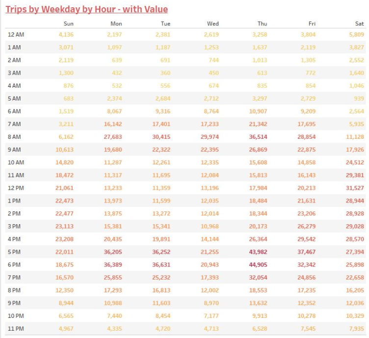
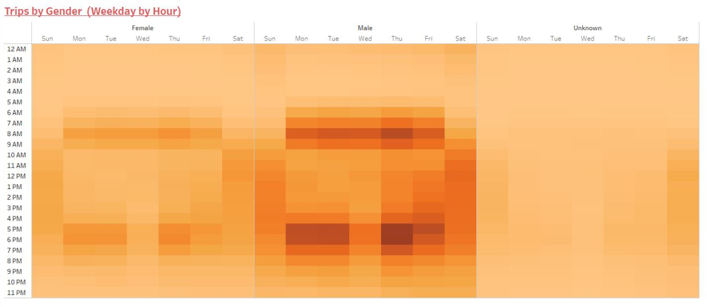

# Des-Moines-Bike-Sharing
## Overview of Project
For this analysis, you’ll use Pandas to change the "tripduration" column from an integer to a datetime datatype. Then, using the converted datatype, you’ll create a set of visualizations to:

  Show the length of time that bikes are checked out for all riders and genders
  Show the number of bike trips for all riders and genders for each hour of each day of the week
  Show the number of bike trips for each type of user and gender for each day of the week.
  Finally, you’ll add these new visualizations to the two you created in this module for your final presentation and analysis to pitch to investors.

1. ***Deliverable 1***: Change Trip Duration to a Datetime Format
2. ***Deliverable 2***: Create Visualizations for the Trip Analysis
3. ***Deliverable 3***: Create a Story and Report for the Final Presentation
4. **Extra**: A written report on Des Moines - Bike Sharing Project Analysis [`README.md`](https://github.com/Cparnell1/Des-Moines-Bike-Sharing). 


# Deliverable 1:  
## Change Trip Duration to a Datetime Format
### Deliverable Requirements:
Using Python and Pandas functions, you’ll convert the "tripduration" column from an integer to a datetime datatype to get the time in hours, minutes, and seconds (00:00:00). After you convert the "tripduration" column to a datetime dataytpe, you’ll export the DataFrame as a CSV file to use for the trip analysis in Deliverable 2.

### Analysis:

1. **The data in the "tripduration" column is converted to a datetime datatype and has the correct time format.**

````py
# CHALLENGE 14
### Des Moines Bike Sharing Project

import pandas as pd

# 1. Create a DataFrame for the 201908-citibike-tripdata data. 
citibike_data = "201908-citibike-tripdata.csv"
citibike_df = pd.read_csv(citibike_data)

# 2. Check the datatypes of your columns. 
citibike_df.info()

# 3. Convert the 'tripduration' column to datetime datatype.
citibike_df['tripdur_orig'] = citibike_df['tripduration']
citibike_df['tripduration'] = pd.to_datetime(citibike_df['tripduration'], unit='m')
citibike_df.head()

# 4. Check the datatypes of your columns. 
citibike_df.info()

# 5. Export the Dataframe as a new CSV file without the index.
citibike_df.to_csv('citibike_201908_updt.csv', index=False)
````

### Results


# Deliverable 2:  
## Create Visualizations for the Trip Analysis
### Deliverable Requirements:
Using Tableau, create visualizations that show:

  - How long bikes are checked out for all riders and genders.
  - How many trips are taken by the hour for each day of the week, for all riders and genders.
  - A breakdown of what days of the week a user might be more likely to check out a bike, by type of user and gender.

1. There is a line graph displaying the number of bikes checked out by duration for all users, and the graph can be filtered by the hour.
2. There is a line graph displaying the number of bikes that are checked out by duration for each gender by the hour, and the graph can be filtered by the hour and gender.
3. A heatmap is created showing the number of bike trips for each hour of each day of the week.
4. A heatmap is created showing the number of bike trips by gender for each hour of each day of the week, and the heatmap can be filtered by gender.
5. A heatmap is created showing the number of bike trips for each type of user and gender for each day of the week, and you can only filter by user and gender.

### Results with detail analysis:

1. **There is a line graph displaying the number of bikes checked out by duration for all users, and the graph can be filtered by the hour.**


2. **There is a line graph displaying the number of bikes that are checked out by duration for each gender by the hour, and the graph can be filtered by the hour and gender.**


3. **A heatmap is created showing the number of bike trips for each hour of each day of the week.**




4. **A heatmap is created showing the number of bike trips by gender for each hour of each day of the week, and the heatmap can be filtered by gender.**




5. **A heatmap is created showing the number of bike trips for each type of user and gender for each day of the week, and you can only filter by user and gender.**


# Deliverable 3:  
## Create a Story and Report for the Final Presentation
### Deliverable Requirements:
For this part of the Challenge, you’ll create a story in Tableau and write a report that describes the key outcomes of the NYC Citibike analysis you did in the module and in Deliverable 2.

1. You must use the five visualizations that you created in Deliverable 2.
2. You must use at least two visualizations that you created in this module.
3. Include the following:
  - Overview of the analysis: Explain the purpose of this analysis.
  - Results: Using the visualizations you have in your Tableau Story, describe the results of each visualization underneath the image..
  - Summary: Provide a high-level summary of the results and two additional visualizations that you would perform with the given dataset.


- CitiBike Analysis tells that more than 80% are Subscribers, with an ~19% or regular non-subscribers, that data creates a new need, such better user experiance interaction in the future.
- Total of 65% General Male use, 25% General Female with an Unknown gender that relies on non-subscribers users. In addition, Peak by Gender spike in same time frame, and Top 10 Start and Ending locations are on same area.


  - Inventory Use and Maintenance may be an issue in the future for CitiBike, checkouts are different depending on time of day time as well as location.